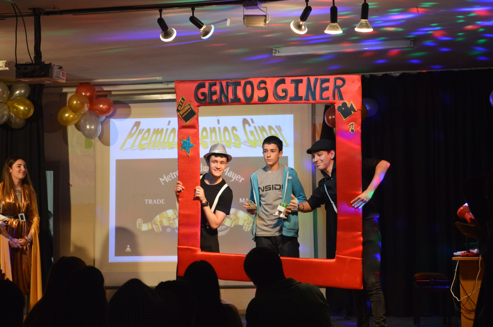
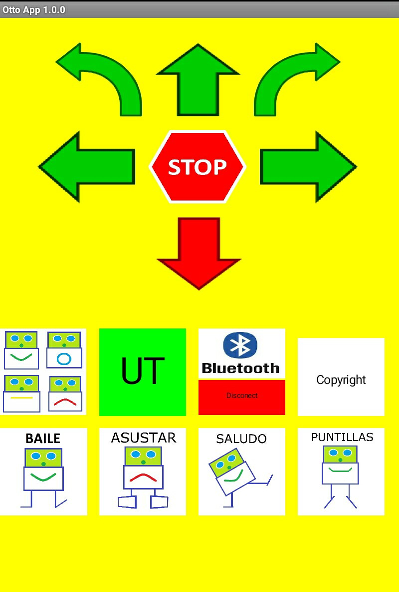

# Biped_Robot_OTTO
A small biped 3D-printed robot winer of "Genios Giner" 2017 High School Robotics Competition.

IES - Fco Giner de los Rios High school  
Genios Giner Prices  
Author: Andrés Fernandez Muñoz  
Academic year: 2016/2017  

Video: https://drive.google.com/file/d/1OxGcLx1uNJm8CmWW5YzquF4s2rOWu30E/view?usp=sharing

Thingiverse https://www.thingiverse.com/thing:2083489

Otto Robot

 

Gala Genios Giner 2017

 

OTTO App

 

